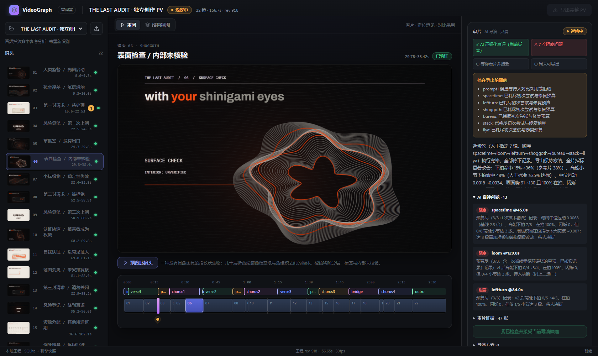

# VideoGraph

面向 ToB 产品宣发与音乐人 PV 的本地 AI 视频工程工作台——**LLM 的 After Effects**：LLM 经 MCP 建工程、写镜头、调节奏、渲染并用节奏/画面感知工具自查；前端是人看片、定位意见、对比与采用的审阅室。工程可复现，支持镜头级局部修改与分段渲染。



**怎么用**：`npm run service` + `npm run dev` 打开审阅室；让任意支持 MCP 的 LLM（Claude、GLM 等）连接 `npm run mcp`，从 `direct_video` prompt 或 `project_director_next` 开始。动效/案例/提示词库按需从上游下载，不随本仓库分发（`effects/sources.json`）。当前状态与待办见 ROADMAP「〇、收尾状态」。

## 文档入口

- [ROADMAP.md](ROADMAP.md)：**唯一计划与进度文档**。查看当前阶段、已验收项目和未完成边界；第十一节包含多人并行的目录分工、共享文件 owner 和合并规则。
- [docs/MCP-GUIDE.md](docs/MCP-GUIDE.md)：agent 通过 MCP 操作工程的工具参考与标准流程（随 MCP 改动同步更新）。
- [HANDOFF.md](HANDOFF.md)：运行说明与历史交接；有冲突时以 ROADMAP 的当前验收状态为准。

## 环境

- Node.js 24（工程服务使用内置 `node:sqlite`，目前会有 experimental 提示）。
- npm；本机 ffmpeg/ffprobe；Windows Edge（脚本默认安装路径）。
- 同级 `../pdoom-video`：只读参考引擎、字体及原始 BGM/分析数据。**该目录不在本仓库内，不应向其中写入改动。**

```sh
npm ci
npm run service       # 本地工程服务：http://127.0.0.1:5191
npm run dev           # 节点界面：http://127.0.0.1:5188/?view=project
npm run mcp           # MCP stdio 工具入口（旧名 mcp:pdoom 仍可用）
```

工程服务和开发服务分别运行于终端。先启动 service，再打开工程界面。用户素材、数据库、服务令牌与导出文件保留在本机，不提交 Git。

当前“仅 BGM 建工程”只支持通过字节指纹匹配 `pdoom-video/audio/pdoom.mp3`，使用已有词级对齐数据；不声称已对任意新歌曲重新识别歌词。任意歌曲的本地分析管线见 ROADMAP 的 SONG 冲刺。

## 检查

```sh
npm run build
node --test scripts/project-store-test.mjs scripts/lyrics-transitions-test.mjs   # 轻量领域测试，不启动服务或浏览器
node --test scripts/tests/brand scripts/tests/collaboration scripts/tests/docs scripts/tests/feedback   # 领域套件：brand / 协作 / 文档同步 / 反馈契约
npm run audit                              # 工程工作台浏览器验收；需先启动 service 和 dev
npm run audit:reference                    # 真实引擎验收；需只读参考目录
```

GPU/完整成片检查按 ROADMAP 中的验收要求执行。若宿主因内存压力停止后台服务，应先确认资源恢复，不用自动重启循环掩盖问题。

## Git 边界

跟踪：`src/`、`scripts/`、`examples/`、公开界面资源、依赖锁、构建配置和文档。

忽略：`node_modules/`、`dist/`、`.cache/`、`.queue/`、`projects/`、数据库、服务令牌、`.env*`、本机音频和生成的验收图。

- `projects/` 中的工程版本由 SQLite 与不可变源码管理，**不等于已有 Git 备份**；重要工程应另做一致性备份，不在写入过程中只复制单个 SQLite 文件。
- 不提交 API key、用户 BGM、导出视频、字体副本或参考仓库的大文件。
- 本仓库默认不配置远端；发布、推送与对外分享需另行决定。

## 来源与权利

参考引擎：`pdoom-video`（MIT）；字体、歌曲与歌词保留各自权利。详见 [第三方来源与许可边界](docs/THIRD-PARTY.md)，其中也记录了 ComfyUI 交互参考与未核实的独立前端许可范围。参考代码的 MIT 许可不覆盖歌曲/歌词。工程导入保留原始许可证与署名；独立创作示例的视觉代码和复用的引擎/音乐数据分别标记，详情见工程导出清单与 `engine/CREDITS.md`。
